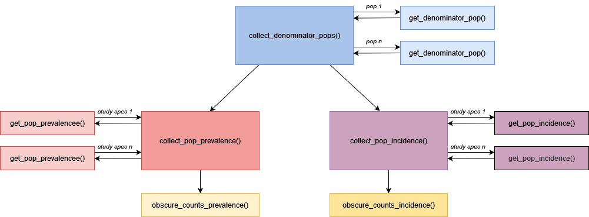

<!-- README.md is generated from README.Rmd. Please edit that file -->

```{r, include = FALSE}
knitr::opts_chunk$set(
  collapse = TRUE,
  comment = "#>",
fig.path = "man/figures/README-",
out.width = "100%"
)
```

# OmopPopEpi

<!-- badges: start -->
<!-- badges: end -->

## Package overview
```{r, echo=FALSE, message=FALSE, out.width = '100%'}
library(here)

```

OmopPopEpi contains functions for estimating population-level incidence and prevalence using the OMOP common data model. The package facilitates the creation of the denominator populations for incidence and prevalence calculations with the collect_denominator_pops() function. Prevalence and inncidence can then be calculated for a set of (previously instanstiated) outcome cohorts, using the collect_pop_prevalence() and collect_pop_incidence() functions. The obscure_counts_prevalence() and obscure_counts_incidence() can then be used to enforce minimum cell counts that may be required before results can be shared. 

## Results specification
The results prdoduced are as follows:   
*To add*

## Package installation

You can install the development version of OmopPopEpi like so:

``` r
install.packages("remotes")
remotes::install_github("darwin-eu/OmopPopEpi")
```

## Example
```{r example}
library(OmopPopEpi)
## basic example code
```

