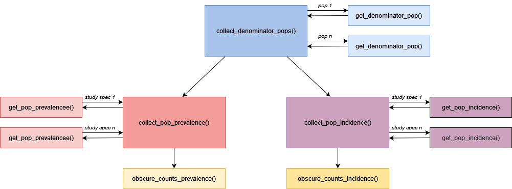

<!-- README.md is generated from README.Rmd. Please edit that file -->

# IncidencePrevalence

<!-- badges: start -->

[](https://github.com/darwin-eu/IncidencePrevalence/actions)
<!-- badges: end -->

## Package overview



IncidencePrevalence contains functions for estimating population-level
incidence and prevalence using the OMOP common data model. The package
facilitates the creation of the denominator populations for incidence
and prevalence calculations with the collect\_denominator\_pops()
function. Prevalence and incidence can then be calculated for a set of
(previously instanstiated) outcome cohorts, using the
collect\_pop\_prevalence() and collect\_pop\_incidence() functions. The
obscure\_counts\_prevalence() and obscure\_counts\_incidence() can then
be used to enforce minimum cell counts that may be required before
results can be shared.

## Results specification

The results produced are as follows:  
*To add*

## Package installation

You can install the development version of IncidencePrevalence like so:

``` r
install.packages("remotes")
remotes::install_github("darwin-eu/IncidencePrevalence")
```

## Example

``` r
library(IncidencePrevalence)
#> Loading required package: lubridate
#> 
#> Attaching package: 'lubridate'
#> The following objects are masked from 'package:base':
#> 
#>     date, intersect, setdiff, union
## basic example code
```
