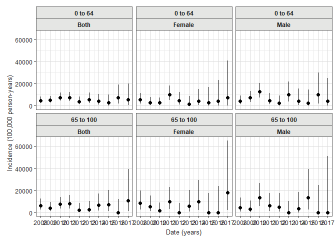
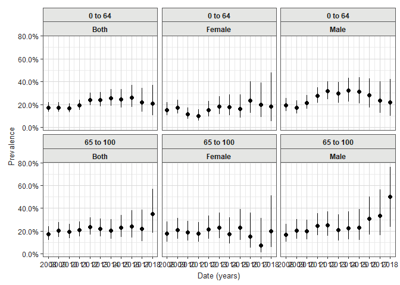

# IncidencePrevalence <a href="https://darwin-eu.github.io/IncidencePrevalence/"></a>

[](https://CRAN.R-project.org/package=IncidencePrevalence)
[](https://app.codecov.io/github/darwin-eu/IncidencePrevalence?branch=main)
[](https://github.com/darwin-eu/IncidencePrevalence/actions)
[](https://lifecycle.r-lib.org/articles/stages.html)

## Package overview

IncidencePrevalence contains functions for estimating population-level
incidence and prevalence using the OMOP common data model. For more
information on the package please see our paper in Pharmacoepidemiology
and Drug Safety.

> Raventós, B, Català, M, Du, M, et al. IncidencePrevalence: An R
> package to calculate population-level incidence rates and prevalence
> using the OMOP common data model. Pharmacoepidemiol Drug Saf. 2023;
> 1-11. doi: 10.1002/pds.5717

If you find the package useful in supporting your research study, please
consider citing this paper.

## Package installation

You can install the latest version of IncidencePrevalence from CRAN:

``` r
install.packages("IncidencePrevalence")
```

Or from github:

``` r
install.packages("remotes")
remotes::install_github("darwin-eu/IncidencePrevalence")
```

## Example usage

### Create a reference to data in the OMOP CDM format

The IncidencePrevalence package is designed to work with data in the
OMOP CDM format, so our first step is to create a reference to the data
using the CDMConnector package.

``` r
library(CDMConnector)
library(IncidencePrevalence)
```

Creating a connection to a Postgres database would for example look
like:

``` r
con <- DBI::dbConnect(RPostgres::Postgres(),
  dbname = Sys.getenv("CDM5_POSTGRESQL_DBNAME"),
  host = Sys.getenv("CDM5_POSTGRESQL_HOST"),
  user = Sys.getenv("CDM5_POSTGRESQL_USER"),
  password = Sys.getenv("CDM5_POSTGRESQL_PASSWORD")
)

cdm <- CDMConnector::cdm_from_con(con,
  cdm_schema = Sys.getenv("CDM5_POSTGRESQL_CDM_SCHEMA"),
  write_schema = Sys.getenv("CDM5_POSTGRESQL_RESULT_SCHEMA")
)
```

To see how you would create a reference to your database please consult
the CDMConnector package documentation. For this example though we´ll
work with simulated data, and we’ll generate an example cdm reference
like so:

``` r
cdm <- mockIncidencePrevalenceRef(sampleSize = 10000, 
                                  outPre = 0.3, 
                                  minOutcomeDays = 365, 
                                  maxOutcomeDays = 3650)
```

### Identify a denominator cohort

To identify a set of denominator cohorts we can use the
`generateDenominatorCohortSet` function. Here we want to identify
denominator populations for a study period between 2008 and 2018 and
with 180 days of prior history (observation time in the database). We
also wish to consider multiple age groups (from 0 to 64, and 65 to 100)
and multiple sex criteria (one cohort only males, one only females, and
one with both sexes included).

``` r
cdm <- generateDenominatorCohortSet(
  cdm = cdm,
  name = "denominator",
  cohortDateRange = c(as.Date("2008-01-01"), as.Date("2018-01-01")),
  ageGroup = list(
    c(0, 64),
    c(65, 100)
  ),
  sex = c("Male", "Female", "Both"),
  daysPriorObservation = 180
)
```

This will then give us six denominator cohorts

``` r
cohortSet(cdm$denominator)
#> # A tibble: 6 × 9
#>   cohort_definition_id cohort_name        age_group sex   days_prior_observation
#>                  <int> <chr>              <chr>     <chr>                  <dbl>
#> 1                    1 denominator_cohor… 0 to 64   Male                     180
#> 2                    2 denominator_cohor… 0 to 64   Fema…                    180
#> 3                    3 denominator_cohor… 0 to 64   Both                     180
#> 4                    4 denominator_cohor… 65 to 100 Male                     180
#> 5                    5 denominator_cohor… 65 to 100 Fema…                    180
#> 6                    6 denominator_cohor… 65 to 100 Both                     180
#> # ℹ 4 more variables: start_date <date>, end_date <date>,
#> #   target_cohort_definition_id <int>, target_cohort_name <chr>
```

These cohorts will be in the typical OMOP CDM structure

``` r
cdm$denominator
#> # Source:   table<main.denominator> [?? x 4]
#> # Database: DuckDB v1.0.0 [root@Darwin 23.4.0:R 4.4.1/:memory:]
#>    cohort_definition_id subject_id cohort_start_date cohort_end_date
#>                   <int>      <int> <date>            <date>         
#>  1                    1          2 2008-01-01        2018-01-01     
#>  2                    1          3 2008-01-01        2018-01-01     
#>  3                    1          4 2008-01-01        2010-05-26     
#>  4                    1          9 2008-01-01        2018-01-01     
#>  5                    1         10 2008-01-01        2014-04-23     
#>  6                    1         17 2008-01-01        2018-01-01     
#>  7                    1         19 2008-01-01        2009-10-20     
#>  8                    1         25 2008-01-01        2018-01-01     
#>  9                    1         28 2008-01-01        2018-01-01     
#> 10                    1         30 2008-01-01        2018-01-01     
#> # ℹ more rows
```

### Estimating incidence and prevalence

As well as a denominator cohort, an outcome cohort will need to be
identified. Defining outcome cohorts is done outside of the
IncdidencePrevalence package and our mock data already includes an
outcome cohort.

``` r
cdm$outcome
#> # Source:   table<main.outcome> [?? x 4]
#> # Database: DuckDB v1.0.0 [root@Darwin 23.4.0:R 4.4.1/:memory:]
#>    cohort_definition_id subject_id cohort_start_date cohort_end_date
#>                   <int>      <int> <date>            <date>         
#>  1                    1          2 2018-04-27        2026-04-20     
#>  2                    1          3 1999-08-30        2007-08-23     
#>  3                    1         10 2027-12-25        2035-12-18     
#>  4                    1         13 1985-12-10        1993-12-03     
#>  5                    1         15 1977-06-17        1980-04-14     
#>  6                    1         16 1970-09-08        1978-09-01     
#>  7                    1         17 1984-03-20        1992-03-13     
#>  8                    1         21 2022-10-21        2030-10-14     
#>  9                    1         27 2046-06-18        2048-02-11     
#> 10                    1         29 1988-04-30        1996-04-23     
#> # ℹ more rows
```

Now we have identified our denominator population, we can calculate
incidence and prevalence as below. Note, in our example cdm reference we
already have an outcome cohort defined.

For this example we´ll estimate incidence on a yearly basis, allowing
individuals to have multiple events but with an outcome washout of 180
days. We also require that only complete database intervals are
included, by which we mean that the database must have individuals
observed throughout a year for that year to be included in the analysis.
Note, we also specify a minimum cell count of 5, under which estimates
will be obscured.

``` r
inc <- estimateIncidence(
  cdm = cdm,
  denominatorTable = "denominator",
  outcomeTable = "outcome",
  interval = "years",
  repeatedEvents = TRUE,
  outcomeWashout = 180,
  completeDatabaseIntervals = TRUE,
  minCellCount = 5
)
plotIncidence(inc, facet = c("denominator_age_group", "denominator_sex"))
```



We could also estimate point prevalence, as of the start of each
calendar year like so:

``` r
prev_point <- estimatePointPrevalence(
  cdm = cdm,
  denominatorTable = "denominator",
  outcomeTable = "outcome",
  interval = "years",
  timePoint = "start",
  minCellCount = 5
)
plotPrevalence(prev_point, facet = c("denominator_age_group", "denominator_sex"))
```



And annual period prevalence where we again require complete database
intervals and, in addition, only include those people who are observed
in the data for the full year:

``` r
prev_period <- estimatePeriodPrevalence(
  cdm = cdm,
  denominatorTable = "denominator",
  outcomeTable = "outcome",
  interval = "years",
  completeDatabaseIntervals = TRUE,
  fullContribution = TRUE,
  minCellCount = 5
)
plotPrevalence(prev_period, facet = c("denominator_age_group", "denominator_sex"))
```


